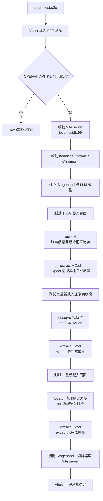

# Stagehand Vue Demo

用 [Stagehand v4](https://docs.stagehand.dev/) 對 Vue 3 專案寫 AI 驅動 E2E 測試的最小示範。

這是部落格文章〈[認識 Stagehand:用自然語言操作瀏覽器的 AI 自動化框架](https://kurohsu.dev/notes/stagehand-intro.html)〉的配套範例,示範四件事:

1. `act()`:用自然語言操作頁面(輸入文字、點按鈕),不寫 selector
2. `extract()` + Zod schema:用自然語言擷取頁面資料,拿回型別安全的結構化結果
3. `observe()` → `act()`:先讓 AI 找到動作,再零推論重放
4. **混用 (hybrid)**:結構穩定的路段用 Playwright 風格 API 零推論做掉(`page.locator().fill()`),只在語意目標上呼叫 AI。這是官方與文章都推薦的實務姿勢,AI 介入程度是滑桿,不是開關

被測目標是一個刻意「不加 `data-testid`」的 Vue 3 待辦清單,模擬真實世界 selector 易碎的場景。測試用 Vitest 當 runner(Stagehand 官方建議:它不是測試框架,請搭配 Vitest/Jest 使用),並在測試內以 Vite API 自動啟停 dev server,一個指令跑完全部。

## 前置需求

- **Node.js >= 22.18**(Stagehand v4 的硬性要求)
- pnpm(或 npm/yarn)
- 本機安裝 Chrome 或 Chromium(`localBrowser` 會啟動它)
- 一把 OpenAI API key

## 使用方式

```bash
pnpm install

# 設定 API key
cp .env.example .env
# 編輯 .env,填入你的 OPENAI_API_KEY

# (可選) 先手動看看被測頁面
pnpm dev

# 執行 Stagehand E2E 測試
pnpm test:e2e
```

## 測試流程

`pnpm test:e2e` 會由 Vitest 統一管理測試生命週期。測試共用同一組 Vite server、瀏覽器與 Stagehand 實例,但每個案例都會重新載入頁面並自行準備狀態;`vitest.config.ts` 也關閉檔案平行執行,避免瀏覽器操作互相干擾。



## 成本說明

測試使用 `openai/gpt-5.6-luna`(輸入 $0.20 / 輸出 $1.20 per 1M tokens)。整份測試約 11 次 LLM 呼叫(三個測試各自獨立準備狀態),單次執行成本遠低於 0.01 美元。想換模型,改 `tests/e2e/todo.test.ts` 裡的 `modelName` 即可(格式是 `provider/model`,前綴必填)。

三個測試的實測對照(2026-08,不同輪會浮動),可以直接看出「AI 介入程度」對成本與時間的影響:

| 測試 | 推論次數 | 耗時 |
| --- | --- | --- |
| 全 AI:act 新增兩筆 + extract 統計 | 5 | 約 10s |
| observe 找動作 → act 零推論重放 | 4 | 約 7s |
| 混用:locator 零推論 + act/extract 收尾 | 2 | 約 4s |

同樣的操作流程,混用寫法的推論次數和時間大約是全 AI 寫法的一半。外推到大型測試套件時這個差距會被放大,所以實務上請把 AI 留給 selector 易碎的路段,穩定路段交給 locator。

## 已知限制

- LLM 推論有不確定性,相同程式碼偶爾會有不同結果。除錯時先看 `act()` 回傳值裡的 `data.actions`,那裡有它實際解析出的 selector 與動作
- `act()` 失敗時不要直接重試(動作可能已產生副作用),要重試請重試 `observe()`
- 快取下來的 Action 在頁面改版後會失效,可用 `Stagehand.create()` 的 `selfHeal` 選項讓它自動退回 AI 重新推論

## 檔案導覽

```
src/App.vue              被測的待辦清單(刻意沒有 data-testid)
tests/e2e/todo.test.ts   Stagehand E2E 測試本體
vitest.config.ts         放寬 timeout(每個自然語言操作都是一次 LLM 推論)
.env.example             API key 範本
```

## 版本備註

本範例以 **Stagehand v4**(2026-08 發佈)為準。網路上多數教學仍是 v2/v3 寫法(`new Stagehand({ env: "LOCAL" })`、`page.act()`、`stagehand.agent()`),在 v4 已不存在,詳見[官方遷移指南](https://docs.stagehand.dev/v4/migrations/v3)。
